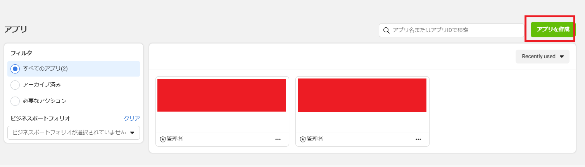
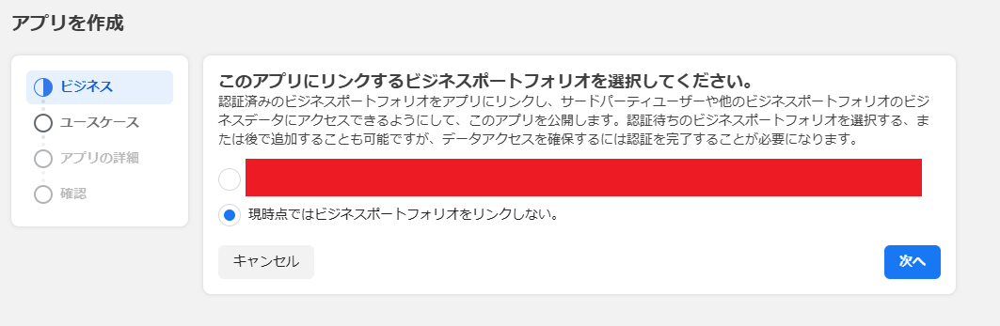
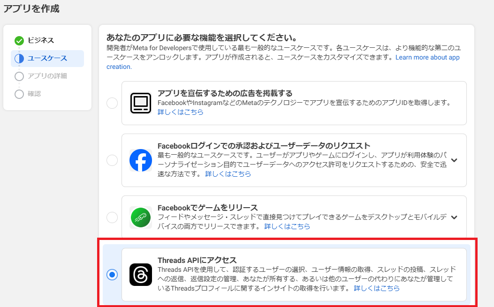
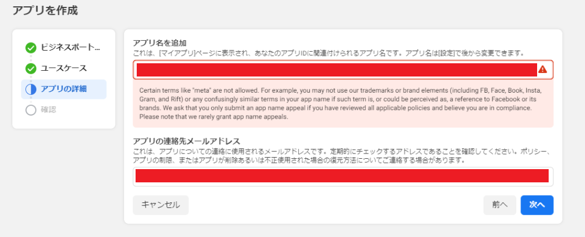
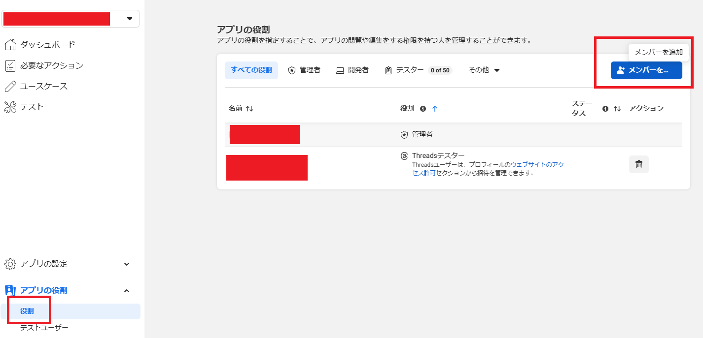
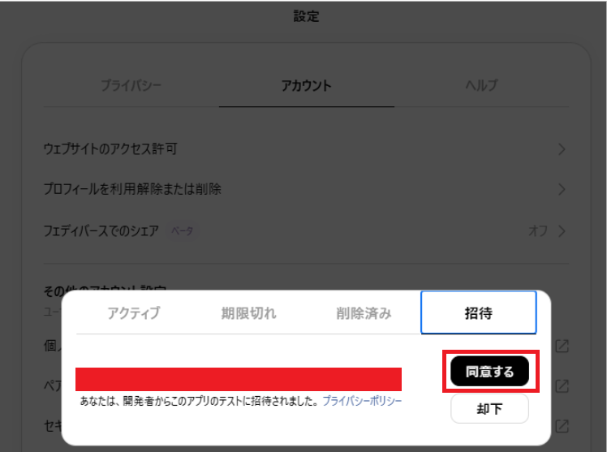
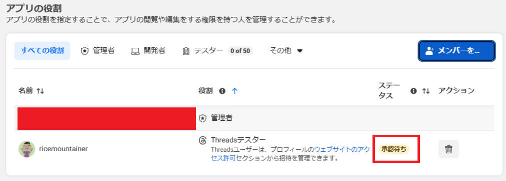
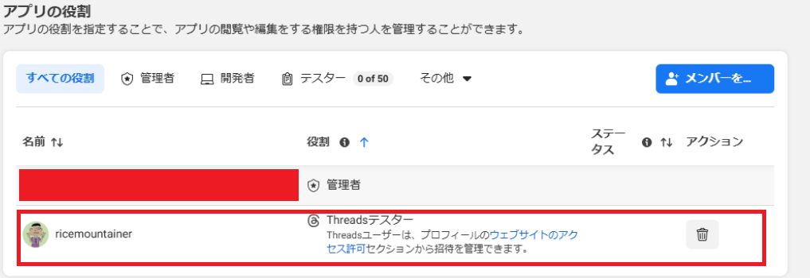
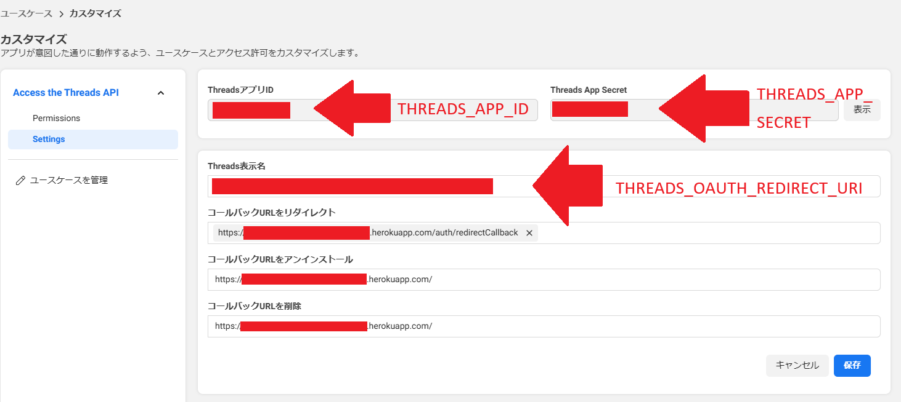

## このリポジトリについて

Threads APIのLong-Lived OAuth Tokenを取得するまでの一連の処理を実行するWebアプリケーションです。Heroku上でホストすることを想定しています。

## Threads API Appの作成

1. [MetaのDeveloperサイト](https://developers.facebook.com/apps/)にいって「アプリを作成」をクリックします。
     
2. 「現時点ではビジネスポートフォリオをリンクしない。」を選択して「次へ」。
     
3. 「Threads APIにアクセス」を選択 して「次へ」。  
     
4. アプリ名、アプリの連絡先メールアドレスを入力して「次へ」。  
     
5. 作成したアプリの「アプリの役割」＞「役割」をクリックして「メンバーの追加」をクリックします。
     
6. 「Threadsテスター」を選択してユーザー名の入力欄に自分のThreadsユーザーのユーザーネーム（`@xxx`の`xxx`の部分）を入力し、SuggestされたThreadsユーザーを選択します。
     
7. 6. で指定したユーザーでThreadsにログインし、「設定」＞「アカウント」タブ＞「ウェブサイトの許可」＞「招待」タブから「同意する」をクリックします。  
     
8. 「アプリの役割」の画面で追加したThreadsユーザーのステータス欄の表示の「承認待ち」が消えたらOK  
       
       
9. 次にサイドバーから「ユースケース」を選択＞「カスタマイズ」をクリックしてOAuthのリダイレクト先を入力します。この画面では`http`で始まるURLはチェックで弾かれてエラーになって登録できません（`https`で始まるURLを指定する必要がある）。
       
10. Threads APIのドキュメントではリダイレクト先のWebアプリとしてHerokuを指定しているので、それに倣ってHerokuにホスティングしたWebアプリを指定する想定で入力する。HerokuアプリのURLが`https://threads-api.herokuapp.com`だとすると、「コールバックURLをリダイレクト」に`https://threads-api.herokuapp.com/auth/redirectCallback`、「コールバックURLをアンインストール」「コールバックURLを削除」についてはルートパスのURL`https://threads-api.herokuapp.com/`を指定します。  
       


## 使い方

1. Herokuに空のアプリを作成します。
2. `THREADS_APP_ID`、`THREADS_APP_SECRET`、`THREADS_OAUTH_REDIRECT_URI`の環境変数をHerokuアプリに設定します。`THREADS_OAUTH_REDIRECT_URI`は「HerokuアプリのURL+`/auth/makeAuthorizeUrl`」に設定します。これら設定はThreads Appのユースケース＞カスタマイズ＞Settingsで設定・確認できます。  
     
3. 本リポジトリを`git clone`します。
4. 1.のアプリのGit URLを設定します(例: `git remote add heroku ...`)  
   参考:https://devcenter.heroku.com/articles/git#for-an-existing-app
5. `git add .`,`git commit -m "some messages"`,`git push heroku main` でHerokuにdeployします。
6. HerokuアプリのURL+`/auth/makeAuthorizeUrl`にブラウザでアクセスして、認証URLを表示します。
   ```
   https://threads.net/oauth/authorize?client_id=...&scope=threads_basic%2Cthreads_content_publish&redirect_uri=https%3A%2F%....herokuapp.com%2Fauth%2FredirectCallback&response_type=code
   ```
7. 6.の認証URLにアクセスします。このとき、標準出力に以下の内容のJSON（Short-Lived Access Token）が出力されているので、その中の`user_id`をメモします。Herokuアプリの場合、標準出力はログとして出力されているので、`heroku logs -a Herokuアプリ名`で確認できます。    
   ```json
   {
     "access_token": "TH...",
     "user_id": 12345678901
   }
   ```
8. Herokuアプリにリダイレクトされ、画面にLong-Lived Access Tokenが表示されます。
   ```json
   result={"access_token":"TH...","token_type":"bearer","expires_in":5183999}
   ```

## APIコール

1. 上記「使い方」7.で入手した`user_id`と上記「使い方」8.で入手した`access_token`でAPIをコールします。
    - `curl`の例:  
      `curl -H "Content-Type: application/x-www-form-urlencoded; charset=utf-8" -d "text=[投稿する文字列]&access_token=[8.のAccess Token]&media_type=TEXT" -X POST https://graph.threads.net/v1.0/[7.のuser_id]/threads`
    - Node.jsで`fetch`を使ったコード例:
      ```javascript
        const url = 'https://graph.threads.net/v1.0/' + user_id + '/threads';
        const data = new URLSearchParams();
        data.append('text', text);
        data.append('access_token' , token);
        data.append('media_type', 'TEXT');
        const result = await fetch(url, {
            method: 'POST',
            headers: {
                'Content-Type': 'application/x-www-form-urlencoded; charset=utf-8'
            },
            body: data.toString(),
        });
        const resultJson = await result.json();
      ```

    以下のような戻り値が返却されます。
    ```json
    {"id":"18192012010201024"}
    ```
2. 上記1.で取得した`creation_id`と、上記「使い方」7.で入手した`user_id`と上記「使い方」8.で入手した`access_token`でAPIをコールします。
   - `curl`の例:  
     `curl -H "Content-Type: application/x-www-form-urlencoded; charset=utf-8" -d "creation_id=[9.のcreation_id]&access_token=[8.のAccess Token]" -X POST https://graph.threads.net/v1.0/[7.のuser_id]/threads`
   - Node.jsで`fetch`を使ったコード例:
     ```javascript
        const url = 'https://graph.threads.net/v1.0/' + user_id +  '/threads_publish';
        const data = new URLSearchParams();
        data.append('creation_id', creation_id);
        data.append('access_token' , token);
        const result = await fetch(url, {
            method: 'POST',
            headers: {
                'Content-Type': 'application/x-www-form-urlencoded; charset=utf-8'
            },
            body: data.toString(),
        });
        const resultJson = await result.json();
     ```

    以下のような戻り値が返却されます。これで投稿は成功しています。
    ```json
    {"id":"18910345817601024"}
    ```

## 参考

https://developers.facebook.com/docs/threads/get-started/get-access-tokens-and-permissions/
https://developers.facebook.com/docs/threads/get-started/long-lived-tokens/
https://developers.facebook.com/docs/threads/posts/